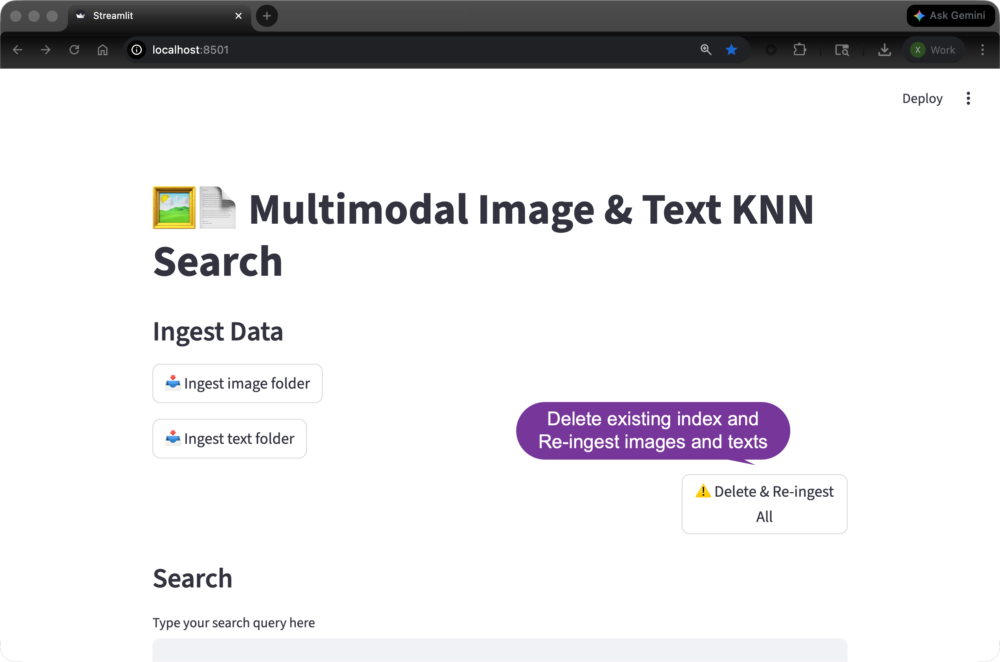
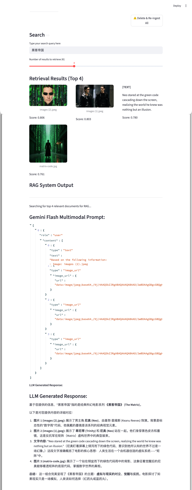

This project shows how to make use of JINA multimodal embedding ([jinaai/jina-embeddings-v4](https://huggingface.co/jinaai/jina-embeddings-v4)) to do semantic search. Further more, it shows how to make use of GEMINI 3 Flash Multimodal LLM do to RAG.

There are two folders:
- images
- texts
In the above two folders, they contain all of the files we want to ingest into Elasticsearch.

In order to run the app, you need to configure the .env file:

**.env**

```
ES_URL="<Your ES_URL>"
ES_API_KEY="Your ES_API_Key"
GEMINI_FLASH_API_KEY="<Your Gemini Flash API Key>"
```
You need to make changes according to your own setup.

**Running the app**
```
streamlit run app.py
```




Another search example "Star wars" can be found at 
[here](pics/pic3.png)

**License** ⚖️

This software is licensed under the [Apache License, version 2 ("ALv2")](https://github.com/elastic/elasticsearch-labs/blob/main/LICENSE).